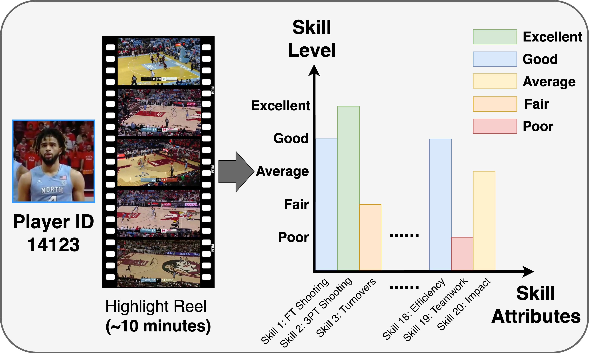

<div align="center">

<h2>BASKET🏀: A Large-Scale Video Dataset for Fine-Grained Skill Estimation</a></h2>

[Yulu Pan](https://yulupan00.github.io/), [Ce Zhang](https://ceezh.github.io/), [Gedas Bertasius](https://www.gedasbertasius.com/)

UNC Chapel Hill

Accepted by **CVPR 2025** 

[Paper](assets/BASKET_A_Large_Scale_Video_Dataset_for_Fine_Grained_Skill_Estimation.pdf) [Project Page](https://sites.google.com/cs.unc.edu/basket) [Data](https://docs.google.com/forms/d/e/1FAIpQLSd_NXfijBL4nIn0aXDNni3VCPoYGUM5l8w55uOtD11qp_g5iQ/viewform?usp=dialog)

</div>

## 🚀 BASKET Highlights 

🔥 **Massive Scale**: BASKET features **4,477** hours of video showcasing **32,232** basketball players from across the globe!<br/><br/>
🔥 **Extensive Diversity**: Spanning **21** basketball leagues, both professional and amateur, featuring over **7,000** female players and detailed skill level annotations across **20** abilities! <br/><br/>
🔥 **Versatile Applications**: BASKET supports advanced video model development and enables domain-specific applications like fair scouting and personalized player development. <br/><br/>


## Introduction



We present BASKET, a large-scale basketball video dataset for fine-grained skill estimation. BASKET contains **4,477** hours of video capturing **32,232** basketball players from all over the world. Compared to prior skill estimation datasets, our dataset includes a massive number of skilled participants with unprecedented diversity in terms of gender, age, skill level, geographical location, etc. BASKET includes **20** fine-grained basketball skills, challenging modern video recognition models to capture the intricate nuances of player skill through in-depth video analysis. Given a long highlight video (8-10 minutes) of a particular player, the model needs to predict the skill level (e.g., excellent, good, average, fair, poor) for each of the 20 basketball skills. Our empirical analysis reveals that the current state-of-the-art video models struggle with this task, significantly lagging behind the human baseline. We believe that BASKET could be a useful resource for developing new video models with advanced long-range, fine-grained recognition capabilities. In addition, we hope that our dataset will be useful for domain-specific applications such as fair basketball scouting, personalized player development, and many others.

## Requirements

Please follow the installation instructions for each model repository.

## Dataset & Annotations

### BASKET Download
To download the BASKET dataset, please complete this [form](https://docs.google.com/forms/d/e/1FAIpQLSd_NXfijBL4nIn0aXDNni3VCPoYGUM5l8w55uOtD11qp_g5iQ/viewform?usp=dialog) to request access. By submitted the form, you are agreeing and acknowledging that you have read and understand the notice. We will reply with the link and the corresponding guidelines after we receive your request.

### Data Structure

```
$DATASET_ROOT
├── BASKET
|  ├── 18-19
|     ├── NBA
|        ├── 1_18_19.mp4
|        ...
|        └── 96713_18_19.mp4
|     ...
|     └── NCAA Division I
|        ├── 113761_18_19.mp4
|        ...
|        └── 560857_18_19.mp4
|        ...
|  ...
|  └── 22-23
|     ├── FIBA Europe Cup
|     ...
|     └── China. CBA

$ANNOTATIONS_ROOT
|  ├── BASKET_Labels
|     ├── BASKET
|        ├── train.csv
|           └── Player 1, skill 1 level ... skill 20 level
|        ├── val.csv
|        └── test.csv
|     ├── cross_season
|        └── test.csv
|     ├── cross_league
|        └── test.csv
|     ├── cross_season_and_league
|        └── test.csv
```

### Annotation Structure
The CSV file includes the video path for each player along with their corresponding ratings for 20 skills. Conceptually, a rating of 0 indicates poor performance in a skill, while a rating of 4 represents excellence.
- We recommand changing the annotation file video path to complete path once downloaded. e.g. /User/my_user_name/BASKET_video/18-19/...mp4
- Conceptually for the defensive consistency skill, a lower rating is better (i.e., 0 represents excellent defense).

### Checkpoint
You can find each model's checkpoint [here](https://www.dropbox.com/scl/fo/yyz359p9tvjgzfaa0hi3o/ACGzVmqaTVkotDl_gH9n9kk?rlkey=rlv3ahno6q78imxwbigk3qlsg&st=cf57kgir&dl=0)

## Training
We trained and tested on 8 NVIDIA RTX A6000 GPUs. Results may slightly vary due to non-fixed random seeds, GPU specifications, and data transmission.

## TODO
- [x] Release Paper
- [x] Release Dataset
- [x] Release Checkpoints
- [x] Code of Inference

## Acknowledgments
